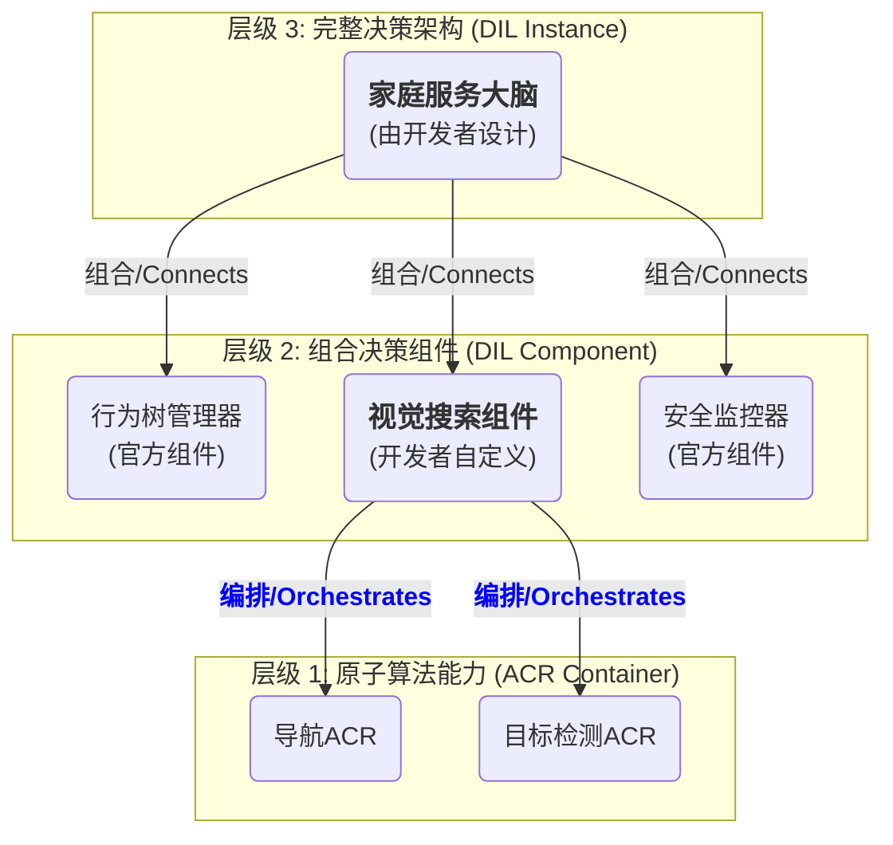

# 🔥 ARF 模块开发参考文档：决策智能层 (DIL) V1.1

> 🎯 **角色定位:** ARF的"**认知架构框架**"与"**决策组件工具箱**" - 赋能开发者构建、组合并部署机器人的“大脑”。
> 
> 📦 **模块代号:** `arf-edge-dil`
> 
> ⚡ **所属:** ARF 边缘平台 (Edge Plane)

## 📋 1. 核心职责与设计理念

### 🎯 核心使命 (Core Mission)

作为ARF的认知核心，DIL的核心使命是**为算法工程师和科研人员提供一个高度灵活、可组合的“决策智能框架”**。它本身不是一个固定的“大脑”架构，而是一个**“组件工具箱”**和一套**“设计规范”**。开发者可以自由选用ARF官方提供的决策组件，或完全自研新的组件，最终像搭乐高一样，构建出最适合特定任务的、独一无二的机器人决策实例 (DIL Instance)。

它的进化目标是不断丰富官方组件库，提供从经典行为树到前沿世界模型的全方位支持，最终成为具身智能领域最高效、最富有创造力的认知架构设计平台。

### 🏗️ 核心概念：可组合的决策层级 (Composable Decision Hierarchy)

ARF的决策智能设计遵循一个清晰、可扩展的三层结构，赋予开发者在不同粒度上创新的能力：

- **层级1：原子算法能力 (ACR Container)**
  
  * **定义：** 每一个ACR容器都是一个独立的、封装好的、可被调用的“原子技能”。例如：`YOLOv8-Detector-ACR`, `RRT-Planner-ACR`, `Grasp-Pose-Estimator-ACR`。
  * **角色：** 构成整个智能生态的**最小功能单元**。

- **层级2：组合决策组件 (DIL Component)**
  
  * **定义：** 一个DIL组件是实现某个特定决策逻辑的模块。它可以是纯逻辑代码，也可以是通过编排多个ACR容器形成的更高级能力。
  * **角色：** 构成最终决策大脑的**“中尺度”构建模块**。开发者既可以使用ARF官方组件，也可以创建自己的组件。

- **层级3：完整决策架构 (DIL Instance)**
  
  * **定义：** 这是由开发者最终设计的、针对特定机器人或应用的完整“大脑”。它是一个由多个“DIL组件”有机组合而成的、可执行的服务。
  * **角色：** 系统的**最终决策者**，是开发者创造力的最终体现。

### ⚖️ 设计原则 (Design Principles)

- **🧠 灵活性优先 (Flexibility First):** 框架必须足够灵活，以支持从传统的行为树到前沿的端到端VLA模型的各种决策范式。
- **🔌 可组合性 (Composability):** DIL的核心是组合。所有组件都应设计为可独立开发、测试，并能轻松地与其他组件连接。
- **🧩 开发者赋能 (Developer Empowerment):** 平台的核心任务是提供工具和高质量的组件，把架构设计的自由度最大化地交给开发者。
- **🤔 可解释性 (Interpretability):** 官方组件的设计应追求可追溯和可调试性，方便开发者理解其内部逻辑。
- **🌱 持续进化 (Continual Evolution):** 框架必须提供接口和机制，支持组件和实例的在线学习与自适应，让智能在边缘端也能持续进化。

## 📝 2. 核心需求 (Framework Requirements)

| **ID** | **需求描述**                        | **验收标准**                                                   | **优先级**       |
| ------ | ------------------------------- | ---------------------------------------------------------- | ------------- |
| **L1** | **组件化框架 (Component Framework)** | 必须提供一个清晰的基类和注册机制，允许开发者创建、注册和连接自定义的DIL组件。                   | **最高**        |
| **L2** | **标准组件库 (Standard Library)**    | 必须提供一套官方维护的、高质量的、可复用的DIL组件（如行为树、世界模型）。                     | **最高**        |
| **L3** | **多模态信息接入**                     | 框架必须让组件能够轻松地从`DMS`订阅和融合多种数据源。                              | **最高**        |
| **L4** | **标准化执行接口**                     | 框架必须让组件能够通过统一、标准化的方式调用`ACR`和`HAL`的服务。                      | **高**         |
| **L5** | **安全策略强制执行**                    | 框架必须提供一种机制，允许安全相关的组件（如`SafetyMonitor`）拥有最高优先级，能够覆盖其他组件的指令。 | **最高**        |
| **L6** | **在线学习接口**                      | 框架必须提供标准的接口，允许组件接入在线学习流程，利用新数据进行自我微调。                      | **高 (V1.1+)** |

## ⚙️ 3. ARF官方DIL组件库 (Official Component Library)

ARF官方将提供并维护一个不断扩充的DIL组件库，作为开发者构建决策架构的基础。

| **组件ID**                       | **组件描述**                           | **核心功能**                                              | **优先级**       |
| ------------------------------ | ---------------------------------- | ----------------------------------------------------- | ------------- |
| **`arf.dil.bt_manager`**       | **行为树管理器**：实现复杂、异步、响应式行为的理想工具。     | 提供一个基于`py_trees`的引擎，用于加载和执行XML/Python定义的行为树。          | **最高**        |
| **`arf.dil.world_model`**      | **世界模型/状态管理器**：维护机器人对自身和环境状态的“信念”。 | 订阅并融合`DMS`数据，提供统一的状态查询接口。V1.1+版本将增加**短期未来预测**能力。      | **最高**        |
| **`arf.dil.safety_monitor`**   | **安全监控器**：作为系统安全的最后一道防线。           | 持续监控关键状态，并在检测到危险时，能够**覆盖**其他组件的输出，执行安全策略。             | **最高**        |
| **`arf.dil.task_planner`**     | **任务规划器**：将用户的抽象指令分解为具体的子任务序列。     | 提供一个LLM代理，可将自然语言指令翻译为结构化的行为树或任务列表。                    | **高**         |
| **`arf.dil.policy_manager`**   | **策略管理器**：管理和执行具体的机器人技能。           | 维护一个可插拔的“策略库”（如导航策略、抓取策略），并根据任务上下文进行动态加载和切换。          | **高**         |
| **`arf.dil.online_learner`**   | **在线学习管理器**：负责DIL在边缘端的持续进化。        | 监控关键交互数据（如失败学习），并在后台触发对本地模型的轻量级微调。                    | **高 (V1.1+)** |
| **`arf.dil.mode_manager`**     | **模式管理器**：管理机器人的全局操作模式。            | 负责在 `AUTONOMOUS` 和 `TELEOPERATION` 模式之间进行安全、可靠的切换。    | **最高**        |
| **`arf.dil.failure_detector`** | **失败检测器**：监控自主任务的执行结果。             | 在检测到任务失败时，能够触发事件，通常用于请求 `ModeManager` 切换到遥操作模式进行人工干预。 | **最高**        |

## 🔗 4. DIL与ACR的高级协同模式

在ARF中，DIL与ACR的关系是灵活且分层的。开发者不仅可以从DIL组件中调用ACR容器，更可以将多个ACR容器组合起来，封装成一个更高级的DIL组件。



**示例：创建一个 `VisualSearchComponent`**

一个 `VisualSearchComponent` 的DIL组件，其内部逻辑可以通过编排调用 `navigation-acr` 和 `yolov8-detector-acr` 这两个原子能力来实现。

```python
# 伪代码示例: VisualSearchComponent.py
from arf_sdk.dil import DILComponent
from arf_sdk.clients import ACRClient # SDK提供的ACR服务客户端

class VisualSearchComponent(DILComponent):
    # DIL组件需要实现标准生命周期方法
    def on_init(self):
        """组件初始化时调用"""
        self.acr_client = ACRClient()
        self.logger = self.get_logger()
        self.logger.info("VisualSearchComponent initialized.")

    # 组件对外暴露的、可被其他组件或行为树调用的方法
    def search_for(self, target_object: str) -> bool:
        """在环境中搜索指定的物体"""
        # 步骤1：调用导航ACR在预设点之间移动
        waypoints = self.get_config("search_waypoints")
        for point in waypoints:
            self.acr_client.call_async("navigation-acr", {"target_pose": point})
            self.wait_for_completion("navigation-acr")

            # 步骤2：在每个点调用检测ACR进行识别
            result = self.acr_client.call("yolov8-detector-acr", {"target": target_object})
            if result.get("found"):
                self.logger.info(f"Found {target_object} at {result.get('location')}")
                return True

        self.logger.warning(f"{target_object} not found.")
        return False
```

## 🛠️ 5. 技术栈与开发环境

| **技术领域**   | **选型**       | **版本要求** | **用途说明**             |
| ---------- | ------------ | -------- | -------------------- |
| **编程语言**   | **Python**   | `3.10+`  | AI生态的核心，最适合实现复杂的决策逻辑 |
| **AI框架**   | **PyTorch**  | `2.0+`   | 用于运行端到端的神经网络策略组件     |
| **行为树**    | **py_trees** | `2.1+`   | 官方`bt_manager`组件的后端  |
| **gRPC框架** | **grpcio**   | 最新稳定版    | 与其他模块的服务接口           |
| **测试框架**   | **Pytest**   | 最新稳定版    | 用于组件和实例的单元测试与集成测试    |

## 🔧 6. 开发实施细节

### 🏗️ 6.1 项目结构

DIL模块的代码将组织为一个Python库 (`arf_dil_framework`)，包含框架核心和官方组件。开发者创建的DIL实例将是独立的项目。

```
sdk/python/arf_dil_framework/
├── arf_dil/
│   ├── core/                  # DIL框架核心 (Component基类, Instance启动器)
│   │   ├── component.py
│   │   └── instance.py
│   └── components/            # 官方标准组件库
│       ├── bt_manager.py
│       ├── world_model.py
│       └── ...
└── pyproject.toml

reference_implementations/
└── home_assistant_dil/      # 一个官方参考DIL实例的项目
    ├── components/            # 该项目自定义的组件
    │   └── custom_grasp_component.py
    ├── main.py                # DIL实例的入口，负责组合和启动所有组件
    ├── behaviors/             # 行为树定义文件
    └── requirements.txt
```

## 🚀 7. 开发任务 (Getting Started)

#### **第一阶段：核心框架与基础组件 (Foundation)**

- **任务1：实现DIL框架核心**
  - **交付物:** 一个Python库，包含`DILComponent`基类和`DILInstance`启动器，让开发者可以注册和连接自定义组件。
- **任务2：开发`WorldModelComponent`和`SafetyMonitorComponent`**
  - **交付物:** 两个核心的官方组件，作为所有决策架构的基础。
- **任务3：编写“如何创建DIL组件”的教程**
  - **交付物:** 一份详细的开发者文档，指导开发者完成第一个自定义组件的开发。

#### **第二阶段：任务编排与官方参考实现 (Orchestration & Demo)**

- **任务1：开发`BTManagerComponent`和`PolicyManagerComponent`**
  - **交付物:** 两个用于任务编排和执行的核心组件。
- **任务2：开发第一个“官方参考DIL实例”**
  - **交付物:** 组合第一、二阶段的官方组件，构建一个能完成“导航到指定点”任务的完整DIL实例，并开源其组合代码，作为最佳实践。
- **任务3：开发`ModeManager`与`FailureDetector`组件**
  - **交付物:** 两个用于实现人机协同和失败学习闭环的关键组件。

#### **第三阶段及以后：高级组件与生态丰富 (Advanced Components & Ecosystem)**

- **任务3.1: 开发`TaskPlanner` (LLM Agent)组件**
  - **交付物:** 一个能与LLM服务交互，进行任务分解的官方组件。
- **任务3.2: 开发`OnlineLearner`组件**
  - **交付物:** 一个能实现边缘端在线微调的官方组件。
- **任务3.3: 丰富参考实例库**
  - **交付物:** 提供更多面向不同场景（如工业、物流）的官方DIL实例，展示框架的强大能力和灵活性。